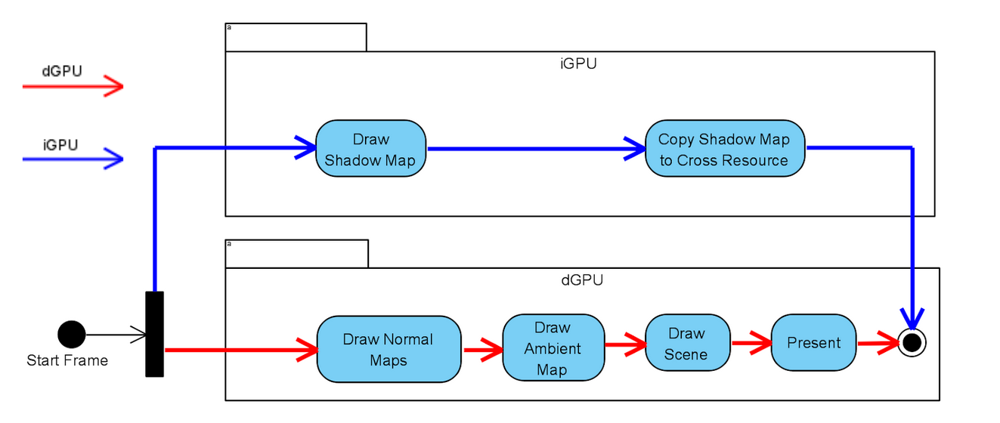
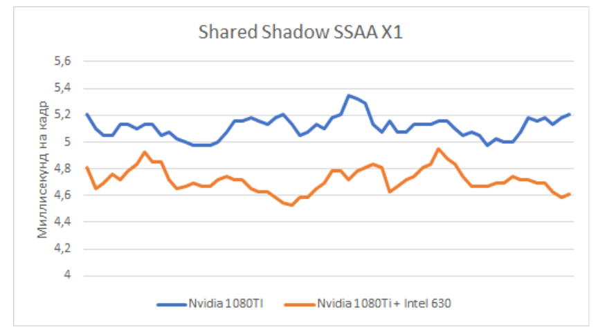
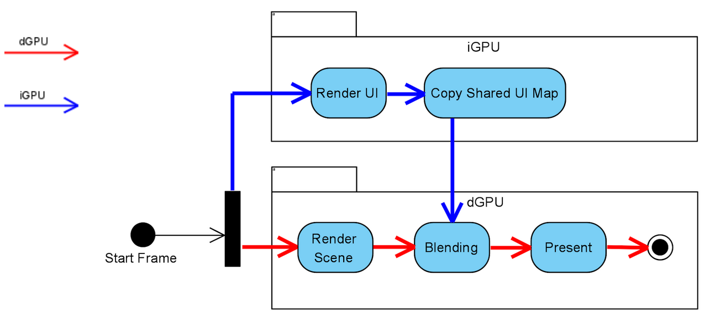
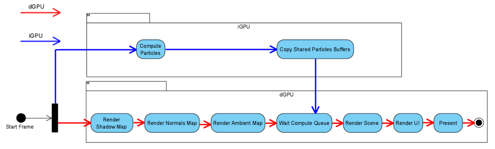
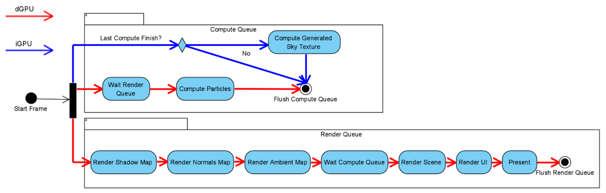
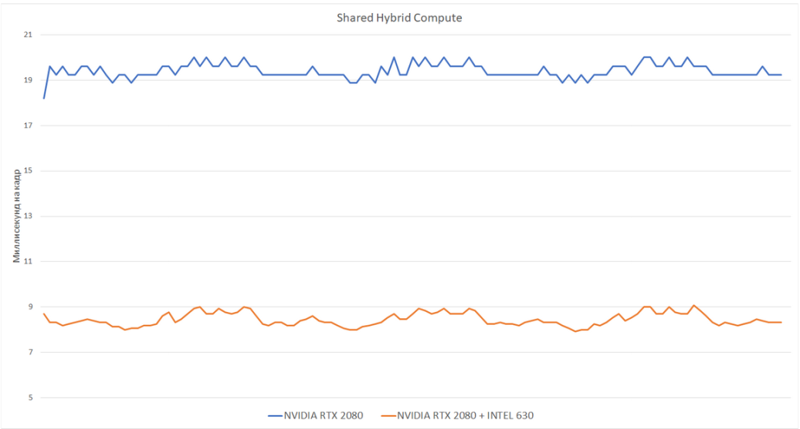
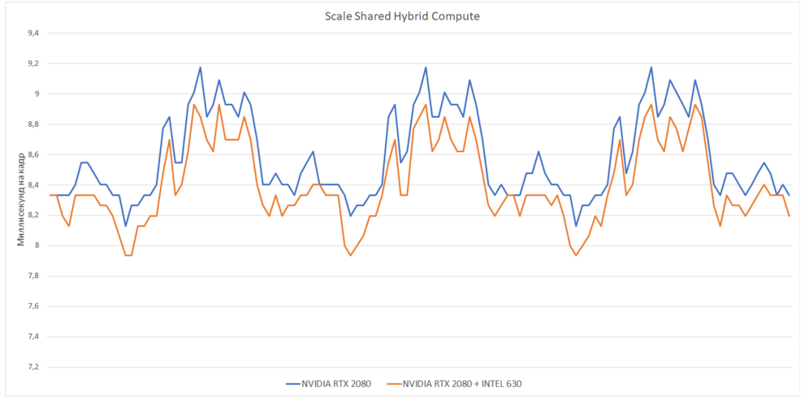

# DX12

This project is my master's thesis. Developed in collaboration with ITMO (https://itmo.ru/ru/) and Sperasoft (https://sperasoft.ru/) https://docs.google.com/presentation/d/16dh4ahcwjb1cMhcog0ikniztRQmwZcg1qDvM6XA27mo/edit#slide=id.p1

This project was taken as the basis for the graphics engine developed in the team. https://github.com/Pepengineers

Several interaction algorithms have been implemented:

## Shared Shadow Map

# Result

## Shared User Interface Blending

# Result

## Shared Particle System

## Shared Hybrid Compute

# Result with full shared

# Result with scaled resource

For the project you need:
 1. Windows SDK 19041 version
 2. Internet for restore Nuget packages
 3. More then one GPU (and/or iGPU/dGPU)
 
Steps for build:
  1. Restore Submodule
  2. Restore Nuget packages
  3. Build any Sample and Copy 'Data' and 'Shaders' folder to build directory
