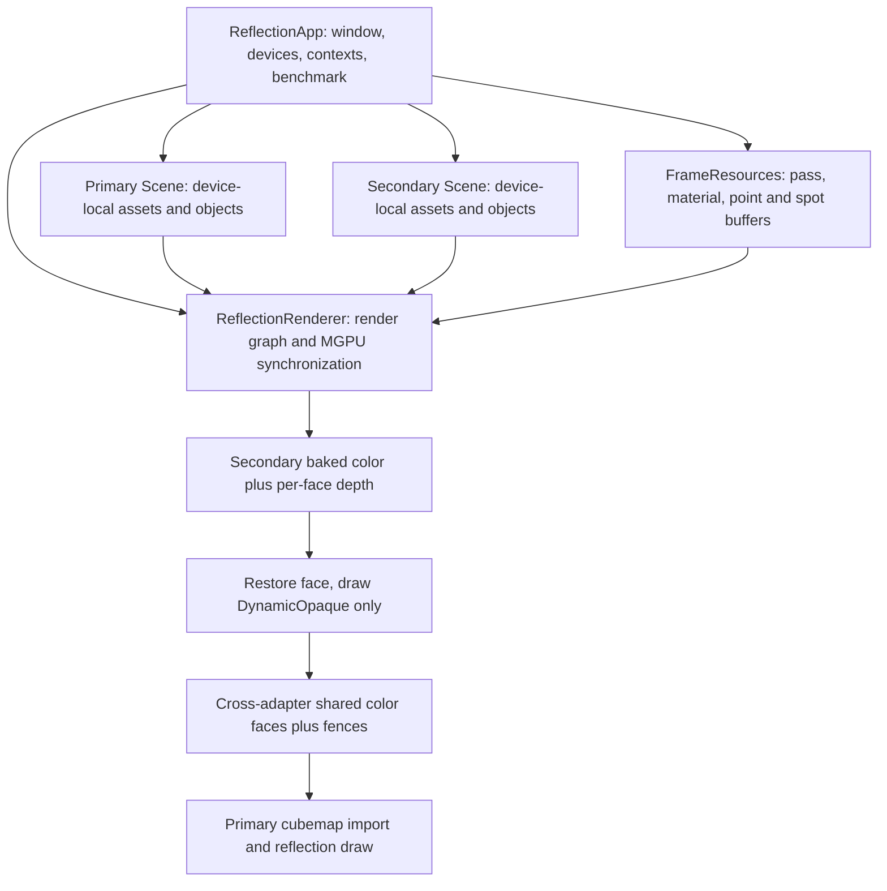
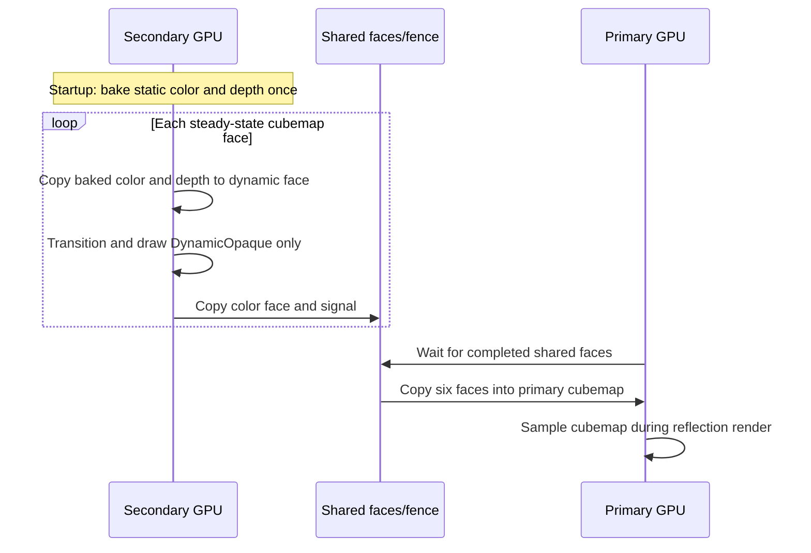

# refactor: Create MGPU-Reflection benchmark

## Goal Capsule

- **Objective:** Add a separate `MGPU-Reflection` project that preserves `MGPU-CubeMap` rendering and MGPU behavior while adopting the `MGPU-SSR` App/Scene/Renderer and benchmark structure.
- **Authority:** User requirements and the observable `BakedCubeMap` branch override analogous SSR structure where the two conflict; other project architecture may be redesigned.
- **Execution profile:** Refactor by characterization: first copy the working project, then move ownership without changing command ordering, resource states, or synchronization.
- **Stop conditions:** Stop if implementation requires changing the baked-color/baked-depth branch or sharing device-local scene assets across adapters.
- **Tail ownership:** Build and smoke-check Debug and Release x64, then perform an independent diff review before handoff.

---

## Product Contract

### Summary

`MGPU-Reflection` is a standalone benchmark derived from `MGPU-CubeMap`. It keeps the original project intact, separates world data from rendering, uses deterministic Release camera motion and Debug free-camera control, and adopts SSR-style StructuredBuffer lighting.

### Problem Frame

`MGPU-CubeMap/HybridCubeMapApp` currently combines resource loading, scene construction, rendering, MGPU synchronization, benchmarking, and input in one class. This makes later benchmark work risky because ordinary ownership refactors can silently alter the baked cubemap algorithm being measured.

### Requirements

**Project isolation**

- R1. Add a solution project named `MGPU-Reflection` without modifying runtime behavior of `MGPU-CubeMap`.
- R2. Give the new project unique Visual Studio project identity, target name, source paths, filters, and solution configuration mappings.

**Scene and rendering ownership**

- R3. A Scene class must require its loading `GDevice` at construction and load textures, materials, models, objects, lights, and camera through `Initialize`.
- R4. A Renderer class must render a linked Scene and own GPU render infrastructure, including PSOs, render targets, descriptor bindings, cubemap targets, cross-adapter resources, barriers, queues, and fences.
- R5. Device-local assets, descriptors, models, materials, and upload buffers must never be reused on another adapter; secondary rendering receives a secondary Scene.

**Benchmark behavior**

- R6. Release builds must start the benchmark automatically and use reproducible camera/object animation reset between benchmark states.
- R7. Debug builds must not auto-run the benchmark and must expose a free camera using the existing `CameraController` input path.

**MGPU cubemap invariants**

- R8. The secondary GPU must bake static cubemap color and per-face depth once before measured steady-state rendering.
- R9. A dynamic update must copy baked color and baked depth, transition them for rendering, draw only dynamic objects, and export the resulting color face to the primary GPU.
- R10. Within the `BakedCubeMap` branch, dynamic updates must not clear copied depth, redraw static geometry, replace baked resources, or change cross-adapter copy/fence ordering.
- R11. The primary GPU must import all six shared faces into its cubemap before sampling it for reflective rendering.
- R12. Single-GPU behavior must remain functional, but its architecture may be reorganized independently from the protected `BakedCubeMap` branch.

**Lighting ABI**

- R13. Directional light data remains in pass/world constants, while point and spot lights move out of fixed light arrays into per-frame StructuredUploadBuffers for every rendering adapter.
- R14. Shaders consume point and spot lights through `StructuredBuffer<Light>` root SRVs and explicit counts; the new project must contain no fixed `MaxLights` pass-constant lighting path.
- R15. CPU structures, root signature slots, shader registers/spaces, buffer capacities, and primary/secondary bindings must agree exactly.

### Key Decisions

- **New project name is `MGPU-Reflection`.** Governs R1, R2.
- **Protect only the BakedCubeMap algorithm; redesign other structure as needed.** Governs R3-R12. SSR may drive the surrounding architecture but cannot replace the baked color/depth algorithm.
- **Use `Scene`, not `World`.** Governs R3-R5. This matches `MGPU-SSR` and existing repository vocabulary.

### Key Flows

- F1. **Initialization:** App creates device pair and command lists; each Scene loads device-local resources; Renderer creates render infrastructure; FrameResources allocate per-device material and light buffers; startup prewarm completes static bake before benchmark measurement.
- F2. **MGPU frame:** secondary restores baked color/depth per face, draws only dynamic objects, copies color to shared resources, signals completion; primary waits, imports six faces, then renders reflections.
- F3. **Build mode:** Release resets deterministic animation and advances benchmark states; Debug attaches free camera controls and renders without benchmark automation.

### Acceptance Examples

- AE1. Given a Release x64 build with two compatible adapters, when benchmark measurement begins, then static color/depth bake has completed and steady-state face updates draw only dynamic objects.
- AE2. Given a Debug x64 build, when the user provides camera input, then camera moves freely and no benchmark state overrides it.
- AE3. Given point and spot lights in the Scene, when either adapter renders, then its own StructuredBuffers supply the same light data and counts without a fixed pass-constant array.
- AE4. Given only one usable adapter, when the application starts, then the existing single-GPU cubemap path remains usable without cross-adapter waits or resources.

### Scope Boundaries

- Original `MGPU-CubeMap` sources and behavior are outside active modification scope.
- No redesign of the protected `BakedCubeMap` color/depth capture, dynamic overlay, cross-adapter copy, or synchronization choreography. Other renderer/App organization may change.
- No shared-library extraction across CubeMap and SSR during this change; duplication is acceptable to keep benchmark behavior isolated.
- No new lighting model beyond the already-established `MGPU-SSR` StructuredBuffer migration.

### Success Criteria

- Both Debug x64 and Release x64 targets compile with shaders.
- Source inspection shows startup-only static bake and dynamic-only steady-state draw.
- Root signature and HLSL binding audit shows matching primary/secondary point and spot light SRVs.
- Original `MGPU-CubeMap` remains unchanged.

---

## Planning Contract

### Key Technical Decisions

- KTD1. **Scene owns logical/device-local world resources.** Move loaders, texture/model/material collections, object ownership, typed draw lists, lights, camera, bounds, update/reset behavior, and scene SRV heap from the monolith into `Scene`.
- KTD2. **Renderer owns synchronization-sensitive GPU work.** Keep protected baked color/depth targets, temporary face resources, shared faces, their barriers/copies/queues/fences together so the `BakedCubeMap` command order remains reviewable; unrelated passes may be reorganized.
- KTD3. **App owns lifecycle and benchmark orchestration.** `ReflectionApp` creates device-pair contexts, Scenes, Renderer, FrameResources, active context selection, resize/input, and Release benchmark states.
- KTD4. **Characterize the BakedCubeMap branch before extraction.** Preserve only its startup bake, baked color/depth restore, dynamic overlay, cross-adapter copy, waits, and signals in original order; surrounding command paths may be reshaped.
- KTD5. **Use SSR lighting ABI with CubeMap render passes.** Copy the FrameResource/root-signature/HLSL resource layout pattern, not SSR reflection-probe logic.
- KTD6. **Keep a capacity of at least one for empty light classes.** D3D12 upload resources remain valid while counts control shader iteration.

### High-Level Technical Design

### Assumptions

- Existing CubeMap scene content and benchmark parameter progression remain authoritative unless compilation forces a mechanical path correction.
- Runtime assets may remain in existing shared root `Data` locations; the new project should not duplicate the large data tree unless its current output-copy rules require it.
- No institutional learning corpus exists under `docs/solutions`; verification therefore depends on current CubeMap/SSR code and build/runtime evidence.

### Risks and Mitigations

- **Baked branch drift:** Moving methods may reorder its barriers or waits. Mitigate with a side-by-side checklist limited to the protected `BakedCubeMap` branch.
- **Depth loss:** Clearing the dynamic face DSV erases static occlusion. Mitigate with explicit audit that baked depth is copied and never cleared before dynamic draw.
- **Cross-device aliasing:** Primary descriptors/models used on secondary cause invalid device ownership. Mitigate with one Scene and one material/light buffer set per adapter.
- **Root signature mismatch:** StructuredBuffer slots can compile but bind incorrectly. Mitigate with one slot enumeration shared by every primary/secondary draw path and a register/space audit.
- **Project-copy collisions:** Reused GUIDs, target names, PDB/intermediate folders, filters, or property paths can overwrite another target. Mitigate with unique identities and solution mappings.
- **Asset working-directory drift:** Relative paths can work in IDE and fail from the output directory. Mitigate by matching repository sample resource properties and testing executable startup.

---

## Implementation Units

### U1. Create isolated MGPU-Reflection baseline

- **Goal:** Copy `MGPU-CubeMap` into a uniquely identified `MGPU-Reflection` target that builds before structural changes.
- **Requirements:** R1, R2.
- **Dependencies:** None.
- **Files:** `MGPU-Reflection/**`, `DX12.sln`.
- **Approach:** Copy source/project/shaders mechanically, rename project metadata and app symbols, assign a new project GUID, preserve shared property imports and asset paths, and add all Debug/Release Win32/x64 solution mappings.
- **Patterns to follow:** `MGPU-SSR/MGPU-SSR.vcxproj`, `MGPU-SSR/MGPU-SSR.vcxproj.filters`, `DX12.sln`.
- **Test scenarios:** Build the copied target in Debug x64 before ownership extraction; confirm its executable and intermediate outputs do not collide with `MGPU-CubeMap`.
- **Verification:** Baseline compiles and original project diff is empty.

### U2. Extract device-local Scene

- **Goal:** Move all resource and object ownership into a Scene initialized by its GDevice.
- **Requirements:** R3, R5, R6, R7.
- **Dependencies:** U1.
- **Files:** `MGPU-Reflection/Scene.h`, `MGPU-Reflection/Scene.cpp`, `MGPU-Reflection/ReflectionApp.h`, `MGPU-Reflection/ReflectionApp.cpp`, `MGPU-Reflection/MGPU-Reflection.vcxproj`, `MGPU-Reflection/MGPU-Reflection.vcxproj.filters`.
- **Approach:** Mirror the public shape of `MGPU-SSR/Scene`, move load/build/sort/update/material/camera responsibilities, retain render-mode membership such as `DynamicOpaque`, and create separate Scenes for primary and secondary adapters.
- **Patterns to follow:** `MGPU-SSR/Scene.h`, `MGPU-SSR/Scene.cpp`.
- **Test scenarios:** Initialize one Scene per adapter and verify object/material/texture/light counts; Debug camera accepts input; Release reset restores identical camera and moving-object transforms.
- **Verification:** App contains no texture/model/material loading implementation and Scene exposes only data/draw/update capabilities needed by Renderer/App.

### U3. Extract Renderer without MGPU behavior changes

- **Goal:** Move rendering and synchronization into a Renderer linked to its Scene while preserving the CubeMap algorithm exactly.
- **Requirements:** R4, R5, R8-R12.
- **Dependencies:** U2.
- **Files:** `MGPU-Reflection/ReflectionRenderer.h`, `MGPU-Reflection/ReflectionRenderer.cpp`, `MGPU-Reflection/ReflectionApp.h`, `MGPU-Reflection/ReflectionApp.cpp`, project and filter files.
- **Approach:** Transfer and preserve the baked/depth resources, shared faces, command order, barriers, queues, waits, and fences belonging to the `BakedCubeMap` branch. Keep startup prewarm explicit. Reorganize other root signatures, PSOs, draw paths, and single-GPU structure where SSR patterns improve clarity.
- **Execution note:** Treat only the `BakedCubeMap` sections of copied `PopulateDynamicCubeMapCommands` as characterization code; compare each transition, copy, draw mode, wait, and signal before accepting that branch's refactor.
- **Patterns to follow:** Class boundary from `MGPU-SSR/ReflectionRenderer`; algorithm body from `MGPU-CubeMap/HybridCubeMapApp.cpp`.
- **Test scenarios:** Covers AE1: startup bake draws static modes once and captures color plus depth; steady-state MGPU updates copy baked data, draw only `DynamicOpaque`, and export six color faces; no dynamic DSV clear occurs; Covers AE4: single-GPU path renders without secondary resources.
- **Verification:** A command-flow audit matches the old protected `BakedCubeMap` branch and both configurations compile.

### U4. Migrate point and spot lighting to StructuredBuffers

- **Goal:** Remove fixed light arrays from pass constants and bind per-frame point/spot buffers on every rendering adapter.
- **Requirements:** R13-R15.
- **Dependencies:** U2, U3.
- **Files:** `MGPU-Reflection/FrameResource.h`, `MGPU-Reflection/FrameResource.cpp`, `MGPU-Reflection/ReflectionRenderer.h`, `MGPU-Reflection/ReflectionRenderer.cpp`, `MGPU-Reflection/Shaders/Common.hlsl`, `MGPU-Reflection/Shaders/Default.hlsl`, `MGPU-Reflection/Shaders/TreeSprite.hlsl`, `MGPU-Reflection/Shaders/LightingUtil.hlsl`.
- **Approach:** Adopt SSR pass fields/counts, allocate primary/secondary point and spot StructuredUploadBuffers, populate from Scene lights each frame, extend root signatures, bind all normal/cubemap/shadow-relevant draw paths, and replace `ComputeLighting(gLights[MaxLights])` loops with typed buffer loops and early rejection.
- **Patterns to follow:** `MGPU-SSR/FrameResource.*`, `MGPU-SSR/ReflectionRenderer.cpp`, `MGPU-SSR/Shaders/Common.hlsl`, `MGPU-SSR/Shaders/Default.hlsl`, `MGPU-SSR/Shaders/TreeSprite.hlsl`.
- **Test scenarios:** Covers AE3: zero point/spot lights uses valid buffers with zero counts; multiple point/spot lights produce matching counts and copies on both adapters; directional light still casts the shadow; source scan finds no `MaxLights` or `worldBuffer.Lights` in the new project.
- **Verification:** HLSL compiles and root parameter indices/register spaces match every draw binding.

### U5. Add Release benchmark and Debug free-camera modes

- **Goal:** Turn the new project into a deterministic benchmark in Release without degrading interactive Debug use.
- **Requirements:** R6, R7.
- **Dependencies:** U2-U4.
- **Files:** `MGPU-Reflection/States/ReflectionBenchmarkState.h`, `MGPU-Reflection/States/ReflectionBenchmarkState.cpp`, `MGPU-Reflection/ReflectionApp.h`, `MGPU-Reflection/ReflectionApp.cpp`, `MGPU-Reflection/Source.cpp`, project and filter files.
- **Approach:** Reuse `BenchmarkService` and state patterns, reset Scene animation on state entry/context activation, exclude benchmark automation under Debug preprocessor guards, and keep existing benchmark parameters relevant to CubeMap.
- **Patterns to follow:** `MGPU-SSR/States/ReflectionBenchmarkState.*`, `MGPU-SSR/ReflectionApp.*`, `Common/Services/BenchmarkService.*`.
- **Test scenarios:** Covers AE1: Release enters benchmark after prewarm and writes progress/log output; Covers AE2: Debug never enters a benchmark state and camera controller remains authoritative; repeated Release state entry restores identical initial transforms.
- **Verification:** Debug and Release x64 compile with distinct intended startup paths.

### U6. Integration verification and cleanup

- **Goal:** Prove the isolated target builds and preserves required behavior, then remove dead copied monolith code.
- **Requirements:** R1-R15.
- **Dependencies:** U1-U5.
- **Files:** All changed `MGPU-Reflection/**` files and `DX12.sln`.
- **Approach:** Build both configurations, run source-level invariants, inspect warnings, compare original CubeMap tree, and perform independent review focused on device ownership and synchronization.
- **Test scenarios:** Debug/Release x64 build; shader compilation; no changes under `MGPU-CubeMap`; no duplicate project GUID; no `MaxLights`; baked depth copy precedes dynamic draw; all six faces imported before reflection sampling; single-GPU code does not dereference secondary resources.
- **Verification:** All build gates pass or any environment-only runtime gap is reported with exact evidence; no abandoned copied classes remain compiled.

---

## Verification Contract

| Gate | Applies to | Command or evidence | Done signal |
|---|---|---|---|
| Debug build | U1-U6 | `C:\Program Files\Microsoft Visual Studio\18\Professional\MSBuild\Current\Bin\MSBuild.exe DX12.sln /m /p:Configuration=Debug /p:Platform=x64 /t:MGPU-Reflection` | Target and HLSL compile with no errors. |
| Release build | U1-U6 | Same command with `Configuration=Release` | Benchmark target compiles with Release path. |
| Original isolation | U1, U6 | Git diff/path audit of `MGPU-CubeMap/**` | No source changes in original project. |
| Lighting ABI | U4 | Root-slot/register-space and source scan | Primary/secondary buffers and HLSL agree; fixed array absent. |
| BakedCubeMap invariant audit | U3, U6 | Side-by-side protected-branch review | Bake, depth restore, dynamic-only draw, copy, wait, import order preserved. |
| Runtime smoke | U5, U6 | Launch Debug and Release on available hardware | Debug camera is free; Release prewarms then benchmarks. |

---

## Definition of Done

- `MGPU-Reflection` exists in `DX12.sln` with unique identity and builds in Debug x64 and Release x64.
- Scene owns and initializes all requested logical resources on its construction device.
- Renderer draws its linked Scene and owns every synchronization-sensitive rendering resource.
- Release benchmark and Debug free-camera behavior are compile-time separated and verified.
- Baked cubemap color/depth, dynamic-only updates, cross-adapter ordering, and single-GPU fallback satisfy R8-R12.
- Point/spot StructuredBuffers and directional pass constant satisfy R13-R15 on both adapters.
- `MGPU-CubeMap` remains unchanged.
- Independent review has no unresolved correctness finding, and dead or abandoned copied code is removed.
